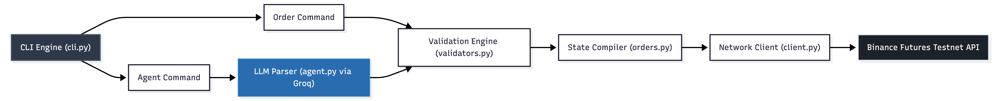

# Binance Futures LLM Trading Bot

A Python trading bot for Binance Futures Testnet (USDT-M). It runs in two modes — standard CLI where you pass flags directly, and an agent mode where you just type what you want in plain English and a Groq LLM figures out the parameters. Built with direct REST calls and HMAC signing rather than the python-binance library, so there's no abstraction hiding what's actually happening.

---

### Architecture




Both paths converge at `validators.py` — LLM output gets treated the same as manual input and has to pass the same checks before anything hits the network.

---

### Setup

1. Clone the repo and navigate into it:
```bash
git clone <repository_url>
cd trading-bot
```

2. Create and activate a virtual environment:
```bash
python3 -m venv venv
source venv/bin/activate
```

3. Install dependencies:
```bash
pip install -r requirements.txt
```

4. Copy the env template and fill in your keys:
```bash
cp .env.example .env
```

You'll need three keys in `.env`:
- `BINANCE_API_KEY` and `BINANCE_API_SECRET` — from [testnet.binancefuture.com](https://testnet.binancefuture.com) (log in with GitHub, generate under API Key tab)
- `GROQ_API_KEY` — from [console.groq.com](https://console.groq.com)

---

### Usage

#### Standard MARKET order
```bash
python cli.py order --symbol BTCUSDT --side BUY --type MARKET --quantity 0.001
```

```
          Order Summary
╭────────────────┬──────────────╮
│ Symbol         │ BTCUSDT      │
│ Side           │ BUY          │
│ Type           │ MARKET       │
│ Quantity       │ 0.001        │
│ Price          │ Market price │
╰────────────────┴──────────────╯
Place this order? [y/N]: y
✓ Order placed successfully
```

#### Standard LIMIT order
```bash
python cli.py order --symbol BTCUSDT --side SELL --type LIMIT --quantity 0.001 --price 150000
```

#### Agent mode — just describe the order
```bash
python cli.py agent "Buy 0.01 BTC at market price"
python cli.py agent "Sell 0.01 ETH limit at 2500"
```

```
Parsing: Sell 0.01 ETH limit at 2500
[INFO] Agent parsing order intent
[INFO] Agent successfully parsed order

       Order Summary
╭────────────────┬─────────╮
│ Symbol         │ ETHUSDT │
│ Side           │ SELL    │
│ Type           │ LIMIT   │
│ Quantity       │ 0.01    │
│ Price          │ 2500.0  │
╰────────────────┴─────────╯
Place this order? [y/N]:
```

Both modes always show a confirmation prompt before placing anything — you have to explicitly type `y`.

---

### Test Harness

```bash
python -m tests.test_harness
```

```
                      Test Harness Results
╭──────┬────────────────────────────────────┬──────────┬───────╮
│ #    │ Test                               │ Result   │ Notes │
├──────┼────────────────────────────────────┼──────────┼───────┤
│ 1    │ Agent parses market buy intent     │ PASS     │       │
│ 2    │ Agent parses limit sell intent     │ PASS     │       │
│ 3    │ Agent rejects gibberish input      │ PASS     │       │
│ 4    │ Valid MARKET BUY params            │ PASS     │       │
│ 5    │ Valid LIMIT SELL params with price │ PASS     │       │
│ 6    │ LIMIT order missing price → error  │ PASS     │       │
│ 7    │ Negative quantity → error          │ PASS     │       │
│ 8    │ Invalid side 'SHORT' → error       │ PASS     │       │
│ 9    │ Lowercase symbol auto-uppercased   │ PASS     │       │
│ 10   │ Price on MARKET order dropped      │ PASS     │       │
╰──────┴────────────────────────────────────┴──────────┴───────╯

Results: 10/10 passed
```

---

### Design Decisions

- **LLM output is never trusted directly.** Whatever the agent parses gets passed through `validators.py` before touching the order layer — same checks as if you typed the flags yourself. If the LLM hallucinates a negative quantity or forgets a price on a LIMIT order, it gets caught and rejected before any API call is made.

- **All signing and retry logic lives in `client.py` only.** HMAC signing, exponential backoff, timeout handling — none of that leaks into `orders.py` or the CLI. If something breaks at the network level, it's one file to look at.

- **Logs are JSON, not text.** Every API call logs the endpoint, params (secret stripped), latency in ms, and status code as a structured JSON line. You can grep for specific order IDs or pipe through `jq` to filter by level without writing any parsing logic.

---

### Assumptions

- Testnet only — not for real money. The architecture isn't set up for production risk management.
- Agent mode uses Groq free tier (`llama-3.1-8b-instant`). Heavy usage will hit rate limits; the client retries with backoff automatically but eventually gives up after 3 attempts.
- Binance enforces a $20 minimum notional on orders. Ran into this during testing with small ETH quantities — keep that in mind when choosing quantity and price.